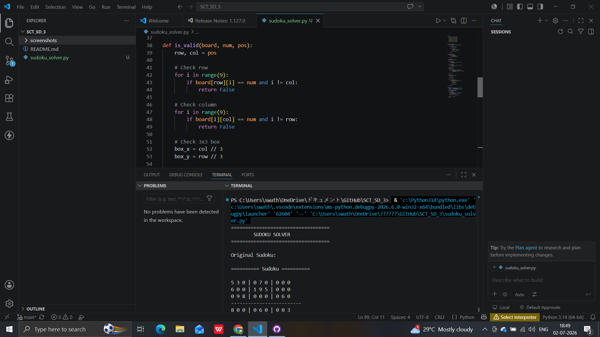
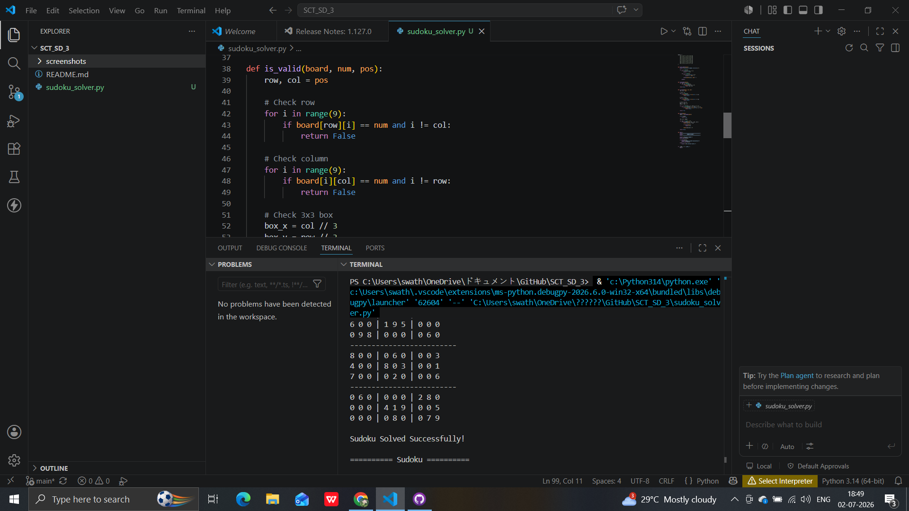

# 🧩 Sudoku Solver

## SkillCraft Technology – Software Development Internship

### 📌 Task 3: Sudoku Solver

## 📖 Project Description

This project is a Python-based **Sudoku Solver** that automatically solves an incomplete 9×9 Sudoku puzzle using the **Backtracking Algorithm**.

The program accepts an unsolved Sudoku grid, identifies empty cells represented by `0`, and fills in the missing numbers while following Sudoku rules.

This project was developed as part of the **SkillCraft Technology Software Development Internship**.

---

## ✨ Features

- 🧩 Solves a 9×9 Sudoku puzzle automatically
- 🔄 Uses the Backtracking Algorithm
- ✅ Checks row, column, and 3×3 box constraints
- 📋 Displays the original Sudoku puzzle
- 🎯 Displays the solved Sudoku puzzle
- 💻 Simple console-based application
- 🧹 Clean and modular Python code

---

## 🛠️ Technologies Used

- Python 3
- Visual Studio Code
- Git
- GitHub

---

## 📂 Project Structure

```text
SCT_SD_3/
│
├── sudoku_solver.py
├── README.md
└── screenshots/
    ├── original_sudoku.png
    └── solved_sudoku.png
```

---

## ▶️ How to Run

1. Clone this repository.
2. Open the project folder.
3. Open Terminal or Command Prompt.
4. Run:

```bash
python sudoku_solver.py
```

5. View the original Sudoku puzzle.
6. The program automatically solves the puzzle and displays the completed Sudoku.

---

## 📸 Output Screenshots

### Original Sudoku



### Solved Sudoku



---

## 📚 Python Concepts Used

- Backtracking Algorithm
- Recursion
- Functions
- Nested Loops
- Lists (2D Matrix)
- Conditional Statements

---

## 🎯 Learning Outcomes

Through this project, I learned:

- How the Backtracking Algorithm works
- Implementing recursion in Python
- Solving constraint-based problems
- Working with 2D lists
- Writing clean and modular code
- Managing projects using Git and GitHub

---

## 🚀 Future Improvements

- Allow users to input their own Sudoku puzzle.
- Develop a GUI using Tkinter.
- Add puzzle validation before solving.
- Support different Sudoku puzzle sizes.

---

## 👩‍💻 Author

**Swathi Niddena**

Software Development Intern

SkillCraft Technology

---

## 📌 Internship Details

- **Organization:** SkillCraft Technology
- **Track:** Software Development Internship
- **Task:** Task 3 – Sudoku Solver

---

## ⭐ Acknowledgement

This project was completed as part of the **SkillCraft Technology Software Development Internship** to strengthen algorithmic thinking, recursion, and Python programming skills.